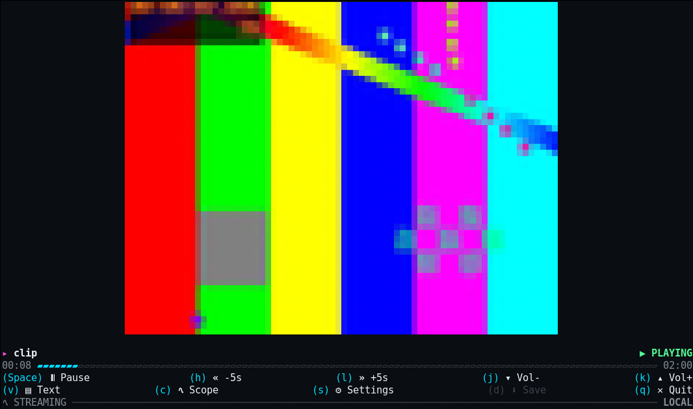
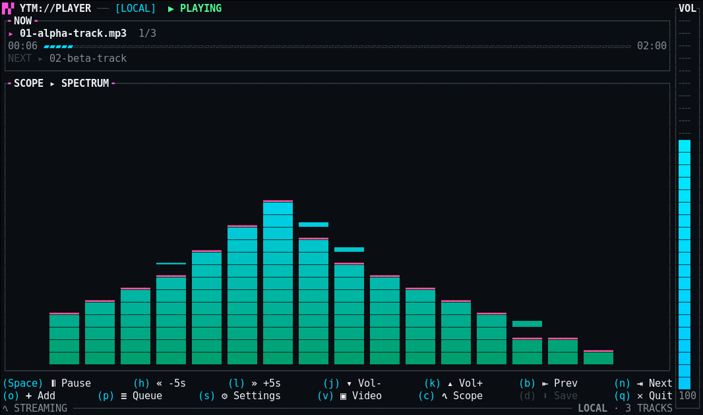
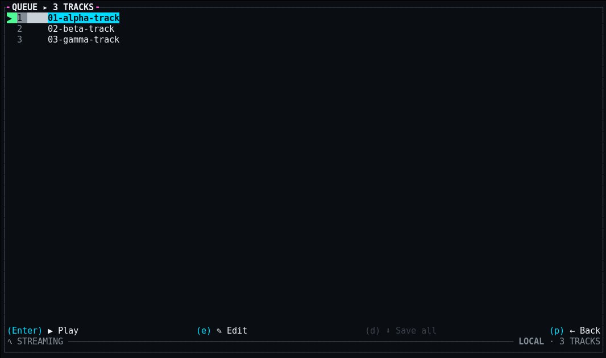
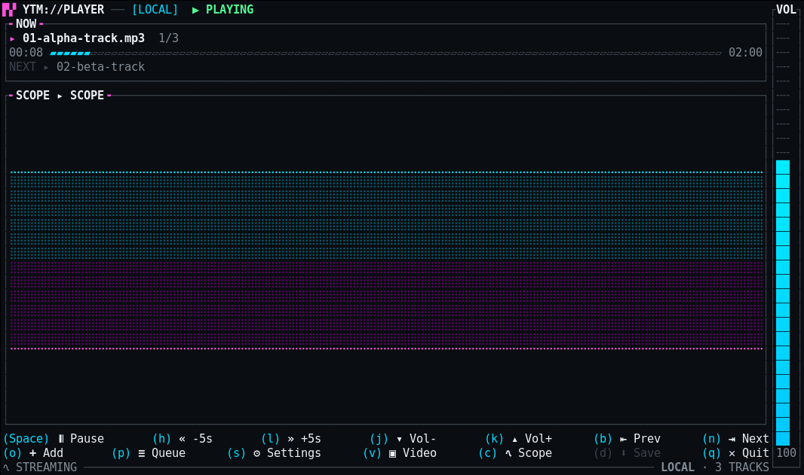

<div align="center">


# YTM-Player

**Paste a link from YouTube, SoundCloud, or Spotify. Get the audio in your terminal — and the picture too, if you ask for it.**

A terminal music player written in Rust. One binary, no runtime of its own: it
drives [mpv](https://mpv.io) and [yt-dlp](https://github.com/yt-dlp/yt-dlp) over
their native interfaces to play YouTube and SoundCloud — and Spotify links, by
matching their tracks to YouTube. Audio streams into a small text UI, the video
renders as true-colour ASCII in the same terminal on a keypress, and tracks pull
down to disk in the background.

<p>
  <a href="https://github.com/Osyna/YTM-Player/actions/workflows/ci.yml"></a>
  <a href="https://github.com/Osyna/YTM-Player/releases/latest"></a>
  
  
  
  
  <a href="LICENSE"></a>
</p>



</div>

---

This started as a Bash script, and for a while that was fine — `mpv` did the
playing, `socat` poked its IPC socket, `jq` read the answers back and `bc` did
the arithmetic for the progress bar. Then one day it wouldn't start at all,
because `bc` wasn't installed. Four tools glued together with a format string,
and the whole thing fell over on the one nobody thinks about.

So it's Rust now: one binary, JSON parsed natively, the socket a plain
`UnixStream`, the arithmetic `f64`. mpv and yt-dlp.


## What it does

- **Audio playback** with a live progress bar, track title, clock and volume.
- **Audio-only by default.** Nothing decodes a picture until you ask for one, so
  an idle session never touches a video frame.
- **`v` puts the video in your terminal** — true-colour half-blocks through
  mpv's built-in `tct` renderer, at the quality you picked in settings (480p by
  default). Playback doesn't stop, restart or re-buffer; the picture is a second
  track handed to the mpv that is already running, and the full player transport
  — title, progress, buttons, status bar — stays pinned below it. Press `v`
  again and the terminal comes back, with the audio never having noticed.
- **`c` cycles live scopes, drawn natively in the TUI** — a 16-band spectrum
  analyzer with falling peak caps, a stereo braille waveform, and broadcast-style
  VU meters with peak-hold needles. No capture device, no loopback, no extra
  process: a transparent tap in mpv's own filter chain measures the audio it is
  already decoding and streams levels to the renderers ~45 times a second, so
  the picture is always in sync — and the scopes live *inside* the player UI,
  next to the volume rail and the queue, instead of taking the screen over.
- **`e` opens an effects rack** — echo, small-room reverb, a +8 dB bass shelf,
  nightcore, centre-cancel karaoke and a slow 8D orbit, any combination at once.
  They are libavfilter chains dropped into the same `af` graph the scopes tap,
  so the picture follows what you hear and nothing spawns a second process.
  Downloads read the demuxer, upstream of every filter: what you save is always
  the clean track. Adding an effect is one line in `src/effects.rs`.
- **`d` saves the current track** into `downloads/` in the background, with a
  live percentage. At the default MP3 tier it's instant and needs no network at
  all — the audio was already captured while it streamed past.
- **`o` adds whatever you paste** — a link or a local path, resolved in the
  background and queued right after the current track. Launched with no
  arguments at all, the player opens on a URL bar instead: paste, Enter, play.
- **Clipboard watch (off by default).** Flip it on in settings and any YouTube,
  SoundCloud or Spotify link you copy anywhere on the system queues itself as
  the next track, with a toast to say so.
- **Crossfade (off by default).** Turn it on in settings and tracks fade into
  each other on auto-advance — 3 to 15 seconds, 5 by default, split across the
  outgoing and incoming track. mpv decodes gaplessly and opens the next entry
  early, so the seam under the fade has no silence in it. Skipping by hand still
  cuts instantly, the last track of a queue plays out clean, and anything
  shorter than twice the transition never fades at all.
- **A settings menu on `s`** — video/download quality (`480p → 720p → 1080p →
  Best`), save format (MP3 or MP4), smart loading, the clipboard watcher, and
  crossfade with its length, persisted to `~/.config/ytmplayer/config`. The
  format is smart: SoundCloud and Spotify are audio-only sources, so they always
  save MP3 whatever the default says.
- **A playlist view on `p`** — every entry titled, scrollable, click or `Enter`
  to jump. `d` there downloads the whole playlist, with a live queued/%/saved
  column per track; pressing `d` again cancels. The main view always shows what
  plays next. Press `e` for **edit mode** and reorder the queue with `J`/`K` —
  mpv follows every move.
- **Titles resolve themselves.** Entries that arrive as URL slugs or numeric
  IDs (SoundCloud sets, raw `.m3u` URLs) show a `⋯` and are re-titled in the
  background from real metadata, a dozen per yt-dlp call.
- **Smart loading.** A Spotify playlist starts playing after a single search —
  the first track resolves alone while the rest match on YouTube in the
  background and append as they land. Measured on a 13-track album: sound in
  3s instead of 14s.
- **Plays YouTube, SoundCloud and Spotify.** Tracks, playlists, albums, sets,
  and SoundCloud radio (station and `/recommended` pages). Spotify can't be
  streamed directly, so its tracks are matched to YouTube by name (that lookup
  uses `curl`).
- **Plays local files too** — a media file, a folder, or an `.m3u`/`.pls`
  playlist. No yt-dlp involved, and nothing to download that isn't already
  on disk.
- **An always-on status bar.** The bottom row of every view — video mode
  included — shows what the transfer machinery is doing: cache state, a
  download's live percent and gauge, or a whole-playlist batch as
  `⬇ QUEUE 7/62 · 42% ▰▰▰▱ <track>`, with the source and track count on the
  right.
- **It fits the terminal it's in.** Buttons render as `(key) icon Label` and
  justify across the whole row; on a terminal too small for them, the scope
  and the video switch off — properly disabled, not squeezed — and come back
  when there's room.
- **Playlists are navigable** with `n` / `b`, the position shown as `4/100`.
- **Everything is clickable.** The UI is [Ratatui](https://ratatui.rs): every
  `(key)` label is a button, the bar seeks, playlist rows jump, the full-height
  **volume rail** on the right sets the level where you click it, and the wheel
  scrolls lists — or turns the volume anywhere else.



## Getting started

Grab a package for your distribution from the
[latest release](https://github.com/Osyna/YTM-Player/releases/latest). Each one pulls in
**mpv** and **yt-dlp** for you, and suggests **ffmpeg** — optional, used to merge separate
video and audio streams when downloading above MP3. **curl** (present on almost every system)
is used only to read Spotify links.

```sh
# Arch, Manjaro, EndeavourOS
sudo pacman -U ytmplayer-bin-3.0.0-1-x86_64.pkg.tar.zst

# Debian, Ubuntu, Mint, Pop!_OS
sudo apt install ./ytmplayer_3.0.0-1_amd64.deb

# Fedora, RHEL, openSUSE
sudo dnf install ./ytmplayer-3.0.0-1.x86_64.rpm
```

On Arch, `makepkg -si` against the attached `PKGBUILD` works too, and builds for aarch64.

Any other distribution — the tarball is one static binary that needs no libraries. Install
`mpv` and `yt-dlp` yourself:

```sh
curl -LO https://github.com/Osyna/YTM-Player/releases/latest/download/ytmplayer-3.0.0-x86_64-linux.tar.gz
tar xzf ytmplayer-3.0.0-x86_64-linux.tar.gz
sudo install -m755 ytmplayer-3.0.0-x86_64-linux/ytmplayer /usr/local/bin/
```

`aarch64` builds of every format are attached too. Checksums in `SHA256SUMS`.

Or build it — no C toolchain, no system libraries, five dependencies:

```sh
git clone https://github.com/Osyna/YTM-Player
cd YTM-Player
cargo build --release
sudo install -m755 target/release/ytmplayer /usr/local/bin/
```

## Using it

```sh
ytmplayer https://www.youtube.com/watch?v=dQw4w9WgXcQ
ytmplayer               # no argument: opens on a URL bar — paste, Enter, play
```

Playlist URLs need quoting, or the shell will background the job on the `&`:

```sh
ytmplayer "https://www.youtube.com/watch?v=XnG3YWYMY-I&list=RDQMxUfpwjvstDY&start_radio=1"
```

SoundCloud and Spotify links work the same way — a track, playlist, album, set,
or SoundCloud radio — and so do local paths:

```sh
ytmplayer https://soundcloud.com/artist/track
ytmplayer "https://soundcloud.com/stations/track/artist/track"   # SoundCloud radio
ytmplayer "https://open.spotify.com/playlist/37i9dQZF1DXcBWIGoYBM5M"
ytmplayer ~/Music          # a folder — or a file, or an .m3u/.pls list
```

| Key | Action |
|---|---|
| `Space` | Play / pause |
| `h` / `l` | Seek back / forward 5s |
| `j` / `k` | Volume down / up |
| `n` / `b` | Next / previous track (playlists) |
| `o` | Add a link or path — plays right after the current track |
| `p` | Queue view: scroll, jump to a track, download the whole list |
| `e` | Effects rack: echo, reverb, bass, nightcore, karaoke, 8D |
| `e` | In the queue: edit mode — `J` / `K` move the selected track |
| `s` | Settings: quality, save format, smart loading, clipboard, crossfade |
| `v` | Toggle ASCII video |
| `c` | Cycle live scopes: spectrum analyzer, stereo waveform, VU meters |
| `d` | Download the current track — or, in the queue view, everything (again cancels) |
| `q` or `Ctrl+C` | Quit |

Every `(key)` label on screen is also a button — click it. The progress bar
seeks, the volume rail on the right sets the level where you click, playlist
rows jump, and the mouse wheel scrolls the playlist or turns the volume
anywhere else.



## How it works

### Where the tracks come from

YouTube and SoundCloud go straight to yt-dlp — a single track, a playlist, or a
SoundCloud set, audio-only until `v` asks for a picture.

Spotify is different: its streams are DRM'd, so a Spotify link is a *reference*,
not a source. The player reads the public `open.spotify.com/embed` page — the
JSON Spotify's own iframe player loads — for each track's name and artist, then
plays the closest YouTube match: one search for a track, one per entry for a
playlist or album. That embed fetch is the only thing that shells out to `curl`,
so Spotify links need it on your PATH; nothing else does.

### Audio first, a picture only when asked

One yt-dlp call resolves a track and returns **both** URLs — full-quality audio
and a low-resolution video. mpv is handed only the audio and started with
`--no-ytdl`, so it never re-extracts anything and never demuxes a picture. The
video URL is kept in our pocket.

Press `v` and that URL is handed to the running mpv as an extra track. That is
why the toggle is instant and playback doesn't so much as hiccup: no new
process, no re-resolve, no seek back to where you were.

It also means resolution is decoupled from playback. Raise the quality in the
`s` menu and the next `v` resolves and swaps the video track underneath you,
while the same audio keeps playing.

### Scopes

`c` doesn't capture your speakers, open a loopback device, or spawn anything —
the player installs a transparent tap in mpv's own audio filter chain. The
audible path passes through untouched; a side branch measures full-band
RMS/peak per channel plus sixteen octave-spaced band energies, and `ametadata`
prints those numbers into FIFOs the player reads ~45 times a second
(`src/viz.rs`). The scopes themselves are ordinary Rust widgets drawn into the
same frame as the rest of the UI (`src/visualizer.rs`) — which is why they can
sit in a pane between the progress bar and the keybar instead of owning the
whole screen, and why switching them is instant. Adding one is a struct with a
`render` method and one line in a registry.



### Downloads

mpv writes the audio it is already streaming to a temp file as it goes. At the
MP3 default, `d` therefore has the whole track on disk the moment you press it —
ffmpeg transcodes the local file and there is no second trip to YouTube. Raise
the tier above MP3 and `d` becomes a real download, because the live stream is
audio and what you asked for isn't.

### Sharing a terminal with mpv

mpv's `tct` renderer paints the terminal directly, which makes it fast and makes
it a problem: for a while both mpv and the status bar were writing to the same
tty. A tty makes a single `write` atomic against other writers, so that looked
safe — but a pty that mpv is flooding at megabytes a second is usually close to
full, and then the kernel takes only part of a larger write. The rest goes out
in a second syscall, with mpv free to paint in the gap.

The result was half a status bar stranded in the middle of the picture, and
once, a cursor move chopped after `ESC [ 29;1` that printed its lone trailing
`H` on screen as a literal character.

So mpv doesn't hold the terminal any more. Its output comes to us on a pipe and
is forwarded by the one writer that owns the screen, cut only at points where no
escape sequence and no UTF-8 character is half-written. Both painters now go
through the same lock, and a short write can't hurt anyone because nothing else
is painting while it finishes.

### Footprint

| | RSS |
|---|---|
| `ytmplayer` itself | **2.8 MB** |
| mpv, audio-only (the default) | 88.5 MB |
| mpv, while you're watching | 106 MB |


### Changes from the Bash version

- `jq`, `socat` and `bc` are gone
- `v`, `d`, playlist and settings views, volume and full mouse support

The full list is in [CHANGELOG.md](CHANGELOG.md).

## Uninstall

```sh
sudo pacman -Rns ytmplayer-bin   # Arch
sudo apt remove ytmplayer        # Debian / Ubuntu
sudo dnf remove ytmplayer        # Fedora / RHEL
sudo rm /usr/local/bin/ytmplayer # tarball or built from source
```

## Contributing

Pull requests are welcome. 
`cargo clippy --release --all-targets`
`cargo test --release`

## Thanks

- **[mpv](https://mpv.io)** — decodes and plays the stream, and draws the ASCII
  video via its own `tct` output. This project is mostly a nice way to talk to
  it.
- **[yt-dlp](https://github.com/yt-dlp/yt-dlp)** — resolves URLs and playlists
  to something playable, and keeps doing so as YouTube keeps changing its mind.
- [@ConttiDev](https://github.com/ConttiDev), who fixed the flicker in the Bash
  version back when there was a Bash version.


## License

[PolyForm Noncommercial 1.0.0](LICENSE). Use it, change it, share it, build on
it — for anything that isn't commercial. Personal use, hobby projects, private
entertainment, study and research are named in the licence, as are schools,
charities, public research bodies and government institutions. Selling it, or
using it to run a business, is not covered.

That makes it source-available rather than open source: the OSI definition
doesn't allow a field-of-use restriction, so there's no OSI badge here. If you
want to use it commercially, ask me.

mpv and yt-dlp are separate programs YTM-Player talks to over an IPC socket and
the command line. It doesn't link against either, so their licences govern them
and this one governs the code in this repository.
