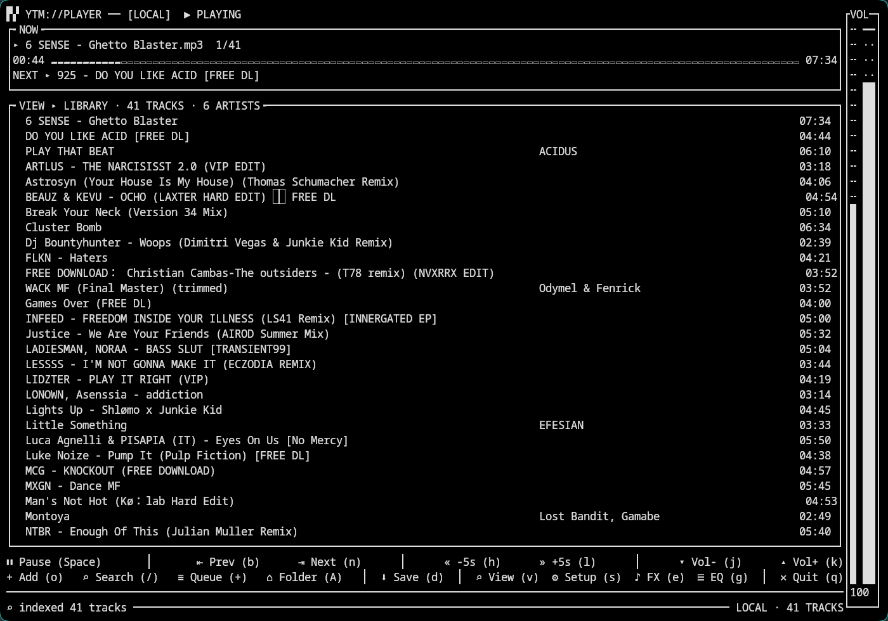
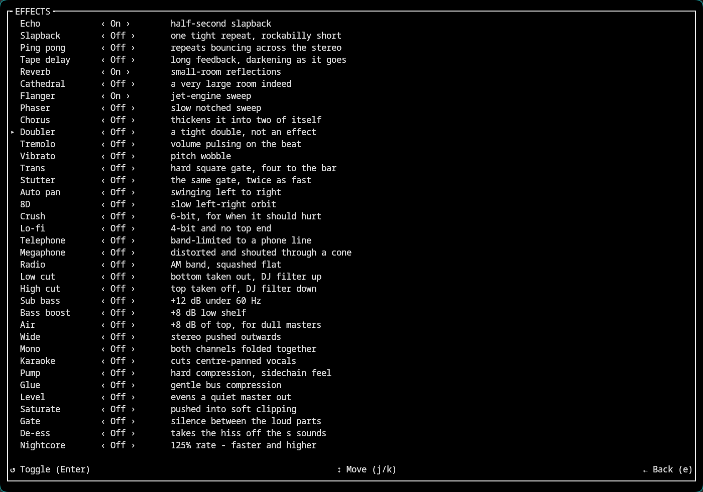
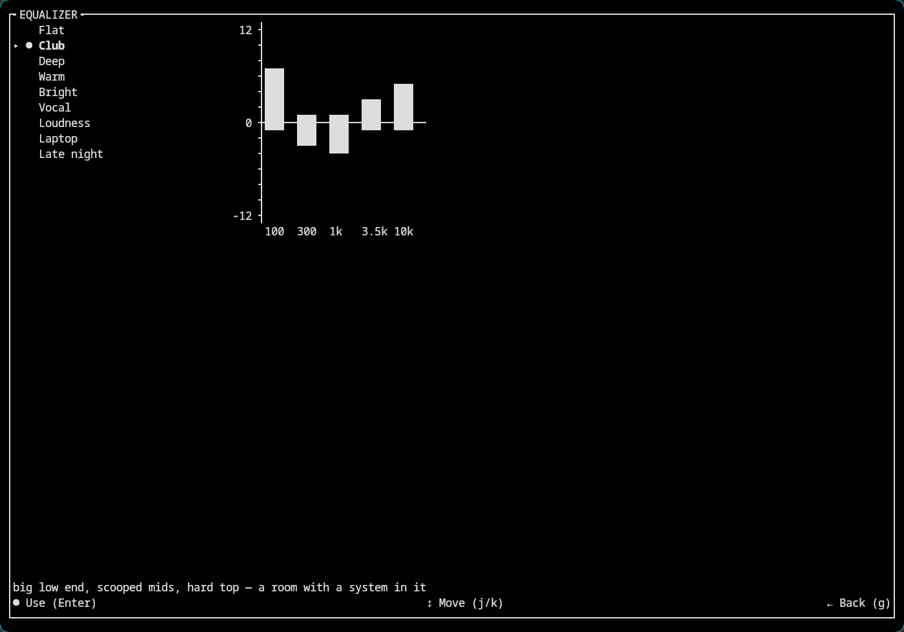

<div align="center">


# YTM-Player

### A DJ booth that lives in your terminal.

**Paste a link from YouTube, SoundCloud or Spotify — or point it at a folder.**
**Beat-matched crossfades, a 38-filter FX rack, a 9-band EQ and true-colour ASCII
video, all in one 1.7 MB binary with no runtime of its own.**

<p>
  <a href="https://github.com/Osyna/YTM-Player/actions/workflows/ci.yml"></a>
  <a href="https://github.com/Osyna/YTM-Player/releases/latest"></a>
  
  
  
  
  <a href="LICENSE"></a>
</p>

*A track playing as true-colour ASCII video — the same terminal, the same keybar, one keypress away.*


[Install](#getting-started) · [Features](#what-it-does) · [Keys](#using-it) · [How it works](#how-it-works)

</div>

---

## What it does

- **Plays almost anything.** A YouTube or SoundCloud link, a Spotify link (matched to
  YouTube — Spotify's streams are DRM'd, its metadata isn't), a search term, or a local
  folder full of MP3s. `ytmplayer` and `ytmplayer boards of canada roygbiv` both just work.
- **Renders the video too** — true-colour ASCII, live, in the same terminal, on one
  keypress. No second window, no X server.
- **Mixes like a DJ, not a jukebox.** Two decks, an automix with 21 written
  transitions, and real beat-matching: it measures tempo and downbeat from the audio
  itself and can land a transition *on* the beat, not just at a timestamp.
- **A 38-filter FX rack** — delays, reverbs up to a cathedral, flanger, phaser, chorus,
  bit-crushers, telephone/radio band-limiting, sidechain-style pumping, nightcore —
  toggle any combination live, rekordbox-style.
- **A 9-preset equalizer** with the curve under the cursor drawn live as bars, from
  flat to a scooped-mid club preset to a gentle laptop-speaker boost.
- **Downloads with the metadata attached** — title, artist, cover art and, once a
  track has been analysed, its BPM — written straight into the file's own tags, so
  the next session (or any other DJ tool) never re-measures it.
- **A live spectrum analyzer and a stereo waveform scope**, plus a full library
  browser over everything on disk and everything you've played.
- **Every key is also a button.** Click the progress bar to seek, the volume rail to
  set a level, a queue row to jump to it — the mouse works everywhere the keyboard does.
- **One static binary**, 1.7 MB, no runtime of its own — it drives `mpv` and `yt-dlp`
  over their existing interfaces instead of reinventing either.

### A closer look

<table>
<tr>
<td width="50%">

**Now playing**


Progress, volume and a live spectrum analyzer with peak caps — click anything
in the keybar, or use the key next to it.

</td>
<td width="50%">

**The queue**


Numbered, reorderable, downloadable — one at a time or the whole thing, tagged
with title, artist and cover art on the way down.

</td>
</tr>
<tr>
<td width="50%">

**Stereo scope**


Braille-drawn waveform, or a spectrum, or a VU meter — `h` / `l` cycle the
style without leaving the view.

</td>
<td width="50%">

**Your library**



Everything on disk and everything you've played, indexed once and searched on
every keystroke.

</td>
</tr>
<tr>
<td width="50%">

**The FX rack**



38 filters, any combination at once — every one of them checked against a
real `ffmpeg` so a typo can never fail silently.

</td>
<td width="50%">

**The equalizer**



Nine presets, the shape of the one under the cursor drawn live — pick one and
both decks pick it up before the next transition.

</td>
</tr>
</table>

<details>
<summary><strong>The full feature list</strong> — click to expand</summary>

- **Audio playback** with a live progress bar, track title, clock and volume.
- **Audio-only by default.** Nothing decodes a picture until you ask for one, so
  an idle session never touches a video frame.
- **One centre panel, four views, chosen on `v`.** The middle of the main view
  is a single panel that holds the **queue**, a **scope**, the **video**, or the
  **library** — whichever you picked. `v` opens the chooser, clicking the panel
  steps to the next view, and the controls under it change with it: the queue
  brings its own Edit and Save-all, the library brings search and rescan, the
  others get out of the way. Nothing opens "over" the player any more.
- **Video in your terminal** — true-colour half-blocks through mpv's built-in
  `tct` renderer, at the quality you picked in settings (480p by default).
  Playback doesn't stop, restart or re-buffer; the picture is a second track
  handed to the mpv that is already running, and the full player transport —
  title, progress, buttons, status bar — stays pinned below it. Pick another
  view and the terminal comes back, with the audio never having noticed.
- **Live scopes, drawn natively in the TUI** — a 16-band spectrum analyzer with
  falling peak caps, a stereo braille waveform, and broadcast-style VU meters
  with peak-hold needles (`h`/`l` in the chooser restyles them). No capture
  device, no loopback, no extra process: a transparent tap in mpv's own filter
  chain measures the audio it is already decoding and streams levels to the
  renderers ~45 times a second, so the picture is always in sync — and the
  scopes live *inside* the player UI, next to the volume rail, instead of
  taking the screen over.
- **`e` opens an effects rack** — 38 of them, rekordbox-style and any combination at
  once: delays (slapback, ping pong, tape), reverbs up to a cathedral, flanger,
  phaser, chorus, tremolo, vibrato, hard square **Trans** and **Stutter** gates, bit
  **Crush** and **Lo-fi**, telephone/megaphone/radio band-limiting, DJ low- and
  high-cut, sub bass, air, stereo **Wide** and **Mono**, karaoke, **Pump** and
  **Glue** compression, saturation, gating, de-essing, and rate tricks from
  **Nightcore** to **Screwed** and **Half speed**. The list scrolls.
  They are libavfilter chains dropped into the same `af` graph the scopes tap,
  so the picture follows what you hear and nothing spawns a second process.
  Downloads read the demuxer, upstream of every filter: what you save is always
  the clean track. Adding an effect is one line in `src/effects.rs`.
- **`g` opens an equalizer** — nine presets over a fixed five-band shape
  (**Flat**, **Club**, **Deep**, **Warm**, **Bright**, **Vocal**, **Loudness**,
  **Laptop**, **Late night**), each named for the situation it is for rather than
  the numbers it holds. The view draws the preset under the cursor as a curve
  about a zero line — half-block resolution, boosts and cuts in different
  colours — so a shape can be *read* before it is heard, and moving the cursor
  previews without committing: `Enter` is what switches. Presets that boost take
  some of it back first (a `+8 dB` shelf on a modern master is a clipped one
  otherwise), and **Flat** emits no filter at all rather than five filters at
  0 dB. It sits ahead of the effects rack in the same `af` graph the scopes tap,
  so tone comes first and the picture still follows what you hear.
- **`d` saves the current track** into `downloads/` in the background, with a
  live percentage. At the default MP3 tier it's instant and needs no network at
  all — the audio was already captured while it streamed past. Saved files are
  tagged and carry their cover art, so they land in a library rather than as
  `title.mp3` with nothing in it. Once a track has been analysed for its tempo,
  the BPM is written into its tags too — `TBPM` and `BPM` both, by remux rather
  than re-encode, so the audio never changes — and read straight back on the
  next scan: a track is only ever measured once, by this player or by any other
  DJ tool that reads the same frame. A track already saved — this session or a
  previous one — plays and mixes from that file instead of the network: the
  status line says `DOWNLOADED`, and the queue marks it `✓` before it has even
  started.
- **Shuffle, repeat and loudness matching.** All three in settings. Shuffle
  reorders the real queue (and keeps the crossfade's second deck in step, which
  matters — it cues by index); repeat covers the track and the whole queue; and
  normalisation levels tracks from their ReplayGain tags, which is worth more
  than it looks with crossfade on, where an unlevelled overlap is a volume jump
  in the middle of the transition.
- **Type a search instead of a link.** Anything that is neither a URL nor a path
  — in the URL bar, in `(o) Add`, or on the command line — is searched on
  YouTube. The best hit starts playing and the rest are in the queue to click.
- **`o` adds whatever you paste** — a link or a local path, resolved in the
  background and queued right after the current track. Launched with no
  arguments at all, the player opens on a URL bar instead: paste, Enter, play.
- **Clipboard watch (off by default).** Flip it on in settings and any YouTube,
  SoundCloud or Spotify link you copy anywhere on the system queues itself as
  the next track, with a toast to say so.
- **Cover art beside the title**, from the file's own tags or a picture next to it -
  a real image on terminals with kitty graphics, half-blocks everywhere else. Nothing
  to show means no box and the full width back.

- **An automix, not a fader.** Crossfade is off by default; turn it on and the
  player runs the transitions itself, in the style you pick in settings.
  **Twenty-one** of them, each a technique with a name: a plain **crossfade**, a
  **bass swap** that holds the arriving track's low end back so two kick drums
  never play at once, a **vocal swap** that does the same to the midrange, a
  **filter sweep**, a **highpass out** that thins the leaving track to its hats, a
  **filter in**, a **brake** that stops it dead with the pitch falling, a **slam**,
  a **drop out**, a **drop swap**, a sixteen-bar **long blend**, a **beat roll**
  that catches the last bar and retriggers it at halving intervals into the swap, a
  **gate out** that chops the leaving track away on eighths, and a **half time**
  that drops it an octave before cutting. There is nothing to hold and nothing to
  time: the parameters live in the settings menu and the mix runs unattended.
- **One fade curve over all of them.** `Linear`, `Smooth`, `Bezier`, `Late` or
  `Early` in settings, applied to every transition at once — the plain fade
  included, so it is worth something even with beat mixing off. It warps the
  transition's *clock*, not its values, which is why it is safe everywhere: a
  constant-power blend stays constant-power (both faders are read at the same
  warped moment, so `out² + in²` is still one), a cut stays a cut, and a drop still
  drops on the beat it was written on. `Late` holds on to the old track and then
  hands over quickly; `Early` does the opposite.
- **Fade length is the whole move**, from three seconds up to thirty. Fifteen
  seconds means seven and a half before the old track ends and seven and a half
  after, and the settings row says so (`15 s = 7.5+7.5`). Where the join falls is the
  score's business — a sixteen-bar blend puts it three quarters of the way in, and
  spends its last four bars on the new track alone.
- **The long blend, in full.** Both tracks run together from the first bar,
  tempo-locked, the arriving one silent with its low end killed and its middle
  pulled back. Four bars take the bass out of the leaving track; four more take
  its top away while the arriving one comes up and its middle is restored; four
  sweep what is left of it out under a lowpass and take its fader down. Then four
  bars of the new track alone with no bass at all — and on the downbeat of the
  sixteenth, its low end arrives in one step. Meanwhile it is let back from the
  old track's tempo to its own, so the drop lands at the speed the record was made
  at.
- **Transitions are files you can edit.** Every one — including the twenty-one that ship —
  is a small readable score of keyframes over named controls, read at startup. Drop
  a `.mix` file in `~/.config/ytmplayer/transitions` and it turns up in the settings
  menu; name it after a built-in and it replaces that one. No rebuild, no Rust. A
  file with a mistake is refused at the line and the player says so on screen. See
  [docs/WRITING-TRANSITIONS.md](docs/WRITING-TRANSITIONS.md).
- **It finds the tempo and lands on the bar.** For the styles that swap rather
  than blend, the player reads the beat out of the audio it is already measuring
  for the scopes, and holds the transition — never more than a bar, never past
  the end of the track — so the swap falls on a downbeat. The status bar says
  `♪ 128 BPM` when it has one and `♪ ON THE BEAT` when it used it. On a heavily
  limited master it often will not find one, says so by staying quiet, and
  transitions on its timer instead.
- **The overlap is real, not a dip.** The next track *starts while the current
  one is still playing*, the two ramped past each other on an equal-power curve
  for 3 to 15 seconds. mpv
  decodes one track at a time, so this runs a second mpv: the two decks trade
  places at every transition, each holding the same queue, so the one that takes
  over already knows where it is and carries on. The incoming deck is cued
  seconds early and waits paused at zero, which is what makes a streamed entry —
  one yt-dlp resolve per advance — land on the beat instead of in a hole.
  Skipping by hand still cuts instantly, pausing freezes the transition with both
  decks, the last track of a queue plays out clean, and anything shorter than
  twice the overlap is played straight through. Off, the second process does not
  exist.
- **A settings menu on `s`** — video/download quality (`480p → 720p → 1080p →
  Best`), save format (MP3 or MP4), smart loading, the clipboard watcher, and
  crossfade with its length and curve, persisted to `~/.config/ytmplayer/config`. The
  format is smart: SoundCloud and Spotify are audio-only sources, so they always
  save MP3 whatever the default says.
- **The queue in the centre panel** (`p`, or pick it on `v`) — every entry
  titled, scrollable with `↑`/`↓` and the wheel, click or `Enter` to jump, and
  the NOW panel and transport still on screen above it. `a` downloads the whole
  queue, with a live queued/%/saved column per track; pressing `a` again cancels.
  `E` turns on **reorder mode** and `J`/`K` move the selected track — mpv follows
  every move.
- **Titles resolve themselves.** Entries that arrive as URL slugs or numeric
  IDs (SoundCloud sets, raw `.m3u` URLs) show a `⋯` and are re-titled in the
  background from real metadata, a dozen per yt-dlp call.
- **Smart loading.** A Spotify playlist starts playing after a single search —
  the first track resolves alone while the rest match on YouTube in the
  background and append as they land. Measured on a 13-track album: sound in
  3s instead of 14s.
- **Plays YouTube, SoundCloud and Spotify.** Tracks, playlists, albums, sets,
  and SoundCloud radio (station and `/recommended` pages). Spotify can't be
  streamed directly, so its tracks are matched to YouTube by name (that lookup
  uses `curl`).
- **Plays local files too** — a media file, a folder, or an `.m3u`/`.pls`
  playlist. No yt-dlp involved, and nothing to download that isn't already
  on disk.
- **A library pane that indexes what you own.** `R` walks `~/Music` (and the
  player's own `downloads/`) with `ffprobe`, reading real tags; `/` searches it
  as you type, ranked so a typo and a half-remembered artist still find the
  track. The index is cached, so a rescan of a thousand files that have not
  changed takes milliseconds rather than seconds. With nothing indexed yet the
  same pane lists what you have actually played.
- **It is on the desktop's media keys.** The player publishes MPRIS2 over D-Bus,
  so the headset button, the GNOME/KDE now-playing popup and `playerctl` all
  drive it — play/pause, next, previous, seek, volume, and the track title where
  the shell expects to find it. Hand-rolled from the wire protocol up, so it
  costs no new dependency and the static binary stays static. No session bus is
  not an error; it is simply absent.
- **It remembers.** Every track you listen to for more than twenty seconds goes
  into a play history, and where you stopped is written as you go — so a bare
  launch offers `(Tab) ↺ Resume` and puts you back on the track and the second
  you left. State lives in `~/.local/state/ytmplayer`, away from the settings
  you might keep in a dotfile repo.
- **An always-on status bar.** The bottom row of every view — video mode
  included — shows what the transfer machinery is doing: cache state, a
  download's live percent and gauge, or a whole-playlist batch as
  `⬇ QUEUE 7/62 · 42% ▰▰▰▱ <track>`, with the source and track count on the
  right.
- **It fits the terminal it's in.** Buttons render as `icon Label (key)`,
  grouped into zones — playback, seek, volume; panel actions, downloads, view
  switches, quit — with a thin `│` between them, and justify across the whole
  row; on a terminal too small for them, the least essential zones give way
  first (a lone divider never survives on its own), and the centre panel and
  the video switch off — properly disabled, not squeezed — and come back when
  there's room. The chooser greys out whatever it cannot show and says why
  instead of failing quietly.
- **Playlists are navigable** with `n` / `b`, the position shown as `4/100`.
- **Everything is clickable.** The UI is [Ratatui](https://ratatui.rs): every
  `(key)` label is a button, the bar seeks, queue rows jump, the centre panel
  steps to the next view, the full-height **volume rail** on the right sets the
  level where you click it, and the wheel scrolls the queue when the pointer is
  over it — or turns the volume anywhere else.

</details>

## Getting started

Grab a package for your distribution from the
[latest release](https://github.com/Osyna/YTM-Player/releases/latest). Each one pulls in
**mpv** and **yt-dlp** for you, and suggests **ffmpeg** — optional, used to merge separate
video and audio streams when downloading above MP3. **curl** (present on almost every system)
is used only to read Spotify links.

```sh
# Arch, Manjaro, EndeavourOS
sudo pacman -U ytmplayer-bin-3.0.0-1-x86_64.pkg.tar.zst

# Debian, Ubuntu, Mint, Pop!_OS
sudo apt install ./ytmplayer_3.0.0-1_amd64.deb

# Fedora, RHEL, openSUSE
sudo dnf install ./ytmplayer-3.0.0-1.x86_64.rpm
```

On Arch, `makepkg -si` against the attached `PKGBUILD` works too, and builds for aarch64.

Any other distribution — the tarball is one static binary that needs no libraries. Install
`mpv` and `yt-dlp` yourself:

```sh
curl -LO https://github.com/Osyna/YTM-Player/releases/latest/download/ytmplayer-3.0.0-x86_64-linux.tar.gz
tar xzf ytmplayer-3.0.0-x86_64-linux.tar.gz
sudo install -m755 ytmplayer-3.0.0-x86_64-linux/ytmplayer /usr/local/bin/
```

`aarch64` builds of every format are attached too. Checksums in `SHA256SUMS`.

Or build it — no C toolchain, no system libraries, six dependencies:

```sh
git clone https://github.com/Osyna/YTM-Player
cd YTM-Player
cargo build --release
sudo install -m755 target/release/ytmplayer /usr/local/bin/
```

## Using it

```sh
ytmplayer https://www.youtube.com/watch?v=dQw4w9WgXcQ
ytmplayer boards of canada roygbiv   # not a link and not a path: a search
ytmplayer ~/Music --shuffle          # a folder, in a random order
ytmplayer                            # no argument: a URL bar — paste, type, or Tab to resume
```

`--shuffle`, `--volume <0-150>`, `--version` and `--help` are the whole flag set.

Playlist URLs need quoting, or the shell will background the job on the `&`:

```sh
ytmplayer "https://www.youtube.com/watch?v=XnG3YWYMY-I&list=RDQMxUfpwjvstDY&start_radio=1"
```

SoundCloud and Spotify links work the same way — a track, playlist, album, set,
or SoundCloud radio — and so do local paths:

```sh
ytmplayer https://soundcloud.com/artist/track
ytmplayer "https://soundcloud.com/stations/track/artist/track"   # SoundCloud radio
ytmplayer "https://open.spotify.com/playlist/37i9dQZF1DXcBWIGoYBM5M"
ytmplayer ~/Music          # a folder — or a file, or an .m3u/.pls list
```

| Key | Action |
|---|---|
| `Space` | Play / pause |
| `h` / `l` | Seek back / forward 5s |
| `j` / `k` | Volume down / up |
| `n` / `b` | Next / previous track (playlists) |
| `v` | Choose what the centre panel shows: queue, scope, video or library |
| `p` | Show the queue there straight away |
| `o` | Add a link or path — plays right after the current track |
| `e` | Effects rack: 38 filters — delays, reverbs, gates, crushers, EQ, dynamics, rate |
| `g` | Equalizer: nine presets, with the one under the cursor drawn as a curve |
| `s` | Settings: quality, save format, smart loading, clipboard, crossfade |
| `d` | Download the current track (again cancels) |
| `q` or `Ctrl+C` | Quit |

With the queue in the centre panel:

| Key | Action |
|---|---|
| `↑` / `↓`, `PgUp` / `PgDn` | Move the cursor |
| `Enter` | Play the selected track |
| `E` | Reorder mode — `J` / `K` move the selected track |
| `a` | Download the whole queue (again cancels) |

With the library in the centre panel:

| Key | Action |
|---|---|
| `/` | Search as you type — `Esc` leaves the filter |
| `↑` / `↓`, `PgUp` / `PgDn` | Move the cursor |
| `Enter` | Play the selected track next |
| `R` | Index `~/Music` and `downloads/` |

In the `v` chooser: `j` / `k` move, `Enter` shows, `h` / `l` restyle the scope,
`v` or `Esc` backs out and leaves the panel as it was.

On the URL bar, `Tab` resumes the last session where it stopped.

Every `(key)` label on screen is also a button — click it. The progress bar
seeks, the volume rail on the right sets the level where you click, queue rows
jump, clicking the centre panel steps to the next view, and the mouse wheel
scrolls the queue when the pointer is over it or turns the volume anywhere else.

## How it works

### Where the tracks come from

YouTube and SoundCloud go straight to yt-dlp — a single track, a playlist, or a
SoundCloud set, audio-only until `v` asks for a picture.

Spotify is different: its streams are DRM'd, so a Spotify link is a *reference*,
not a source. The player reads the public `open.spotify.com/embed` page — the
JSON Spotify's own iframe player loads — for each track's name and artist, then
plays the closest YouTube match: one search for a track, one per entry for a
playlist or album. That embed fetch is the only thing that shells out to `curl`,
so Spotify links need it on your PATH; nothing else does.

### Audio first, a picture only when asked

One yt-dlp call resolves a track and returns **both** URLs — full-quality audio
and a low-resolution video. mpv is handed only the audio and started with
`--no-ytdl`, so it never re-extracts anything and never demuxes a picture. The
video URL is kept in our pocket.

Pick the video view and that URL is handed to the running mpv as an extra track.
That is why switching is instant and playback doesn't so much as hiccup: no new
process, no re-resolve, no seek back to where you were. A track that turns out to
have no picture is remembered as such, so the panel stops offering it one and a
click can't buy the same failed yt-dlp lookup twice.

It also means resolution is decoupled from playback. Raise the quality in the
`s` menu and the next switch to video resolves and swaps the video track
underneath you, while the same audio keeps playing.

### Writing your own transition

`src/transitions.rs` is a small declarative language, not a pile of special cases. A
transition is a `Recipe`: lanes of keyframes over named controls, on either deck.

```rust
lane(Outgoing, Bass, &[
    key(At::Bar(0.0), 0.0, Smooth),     // start flat
    key(At::Bar(4.0), -40.0, Hold),     // gone by bar four, and stay gone
    key(At::Bar(16.0), -40.0, Hold),
]),
```

`Bar` for moves that are counted, `Frac` for moves that are not. `Hold` for a drop —
a hold and a jump is exactly what a drop is. `PowerDown`/`PowerUp` as a pair for a
blend, because two overlapping tracks are uncorrelated and it is `out² + in²` that has
to stay at one.

The evaluator turns lanes into gains, one quantised `af` chain per deck, and a tempo
for each. The quantising is not cosmetic: every distinct chain rebuilds mpv's filter
graph mid-playback, so a continuously computed cutoff would pay for that on every frame
instead of seven times.

Adding a recipe needs no other change anywhere. The full guide, including the rules the
tests enforce and why each exists, is in
[docs/WRITING-TRANSITIONS.md](docs/WRITING-TRANSITIONS.md).

### Beat-matching a track that is not playing

The tap only ever hears the deck that is playing, so the track *after* this one is silent
and unmeasured right up to the moment it matters. `src/preview.rs` decodes a slice of it
with one ffmpeg process and runs the same sixteen bandpasses the tap does — the same RBJ
biquads, the same centres, the same dB mapping — so the beat tracker is fed the same shape
of measurement whichever deck it came from. Checked against libavfilter's own output: the
per-band RMS agrees to 0.002 dB, and against the live tap at matched rates the correlation
is 1.00000. Ninety milliseconds for a local file, a third of a second over the network, on
its own thread, started at the cue several seconds before anything needs the answer.

That is what lets the long blend open the next deck already at the right speed rather than
lurching into it.

### The automix

Five transition styles, applied automatically. The maths is in `src/transitions.rs`
and it is all one shape: `shape(style, t)` returns what both decks should be doing
at instant `t` — a gain each, and optionally an mpv filter chain each. A bass swap
holds `bass=g=-40` on the arriving track and slides it off as the outgoing track's
own low end is pulled out; a filter sweep drops a lowpass over the leaving track;
an echo out gives it a tail. Every style is `cos`/`sin` of a *warped angle* rather
than a warped pair of gains, so the Pythagorean identity pins `out² + in²` at 1
whatever the warp and no style can dip in the middle. The filter strings are
quantised into a handful of steps, so a transition rebuilds mpv's filter graph
four or seven times rather than thirty times a second.

One thing worth knowing, because it cost a while to find: **mpv accepts a filter
string it cannot parse, over IPC, and reports success.** A typo in an `af` chain
does not error, does not log, and silently does nothing. Every string this player
can emit is checked against a real mpv through the command line, where a bad
filter does exit non-zero.

Beat alignment is `src/analysis.rs`. It reads the same 16 band levels the scopes
draw — no PCM crosses into it — takes spectral flux for onsets, autocorrelates for
tempo and combs for phase, and refuses to answer unless it is sure. That refusal is
the whole design: a player that cuts a song on an invented tempo is worse than one
that never cuts on the beat at all, so silence, noise and a held tone all report
zero confidence rather than something plausible. The player only listens in the
last thirty seconds of a track, and lifts its redraw rate while it does, because
the redraw rate *is* the sample rate — at the text cadence a beat is four samples
wide and the tracker rightly declines to commit.

### Crossfade: two decks

An overlap needs two things playing at once, and mpv plays one track at a time.
So the player runs two of them. Both hold the same playlist, so they are
interchangeable: at a transition the parked deck is cued on the next entry —
paused at zero, opening its stream in its own time — and when the playing track
is `crossfade_secs` from its end, the parked deck is unpaused and the two are
ramped past each other on a `cos`/`sin` pair. Uncorrelated signals add in power,
not amplitude, so equal-power is the curve that keeps loudness flat across the
overlap; a linear pair would dip audibly in the middle.

The deck that was playing is pinned with `keep-open=always` for the length of the
transition, so it parks at its own end instead of racing us into the entry the
other deck is already halfway through. When the ramp completes the decks trade
roles: the incoming one becomes the player — already at the right place in the
queue, so it just carries on advancing — and the outgoing one is stopped and
parked for next time, keeping its playlist so the next cue costs one command.
The visualizer tap moves across with the swap; effects ride both decks so the
incoming track sounds like the outgoing one.

Turn the setting off and the second process is not spawned at all.

### Scopes

The scopes don't capture your speakers, open a loopback device, or spawn
anything — the player installs a transparent tap in mpv's own audio filter
chain. The
audible path passes through untouched; a side branch measures full-band
RMS/peak per channel plus sixteen octave-spaced band energies, and `ametadata`
prints those numbers into FIFOs the player reads ~45 times a second
(`src/viz.rs`). The scopes themselves are ordinary Rust widgets drawn into the
same frame as the rest of the UI (`src/visualizer.rs`) — which is why they can
sit in the centre panel between the progress bar and the keybar instead of
owning the whole screen, and why switching them is instant. Adding one is a struct with a
`render` method and one line in a registry.


### MPRIS, by hand

`playerctl play-pause` works on this player, and so does the media key on a pair
of headphones, because it speaks MPRIS2 — which is D-Bus, which is a wire
protocol nobody wants to implement. It is implemented here anyway, in
`src/mpris.rs`: the SASL EXTERNAL handshake, the little-endian marshaller with
its eight-byte struct alignment, the header field array, `a{sv}` metadata
dictionaries, `PropertiesChanged` and `Seeked`. That is a few hundred lines of
fiddly encoding against a dependency tree that would otherwise have been larger
than the rest of the player put together, and it keeps the promise the rest of
the project makes: mpv over its own IPC, yt-dlp over its own arguments, the
terminal over its own escapes, and now the desktop over its own bus.

Publishing is diffed, so a player redrawing twenty times a second emits nothing
at all while it is playing the same track at the same volume. Commands are
drained once a frame before the frame is published, so a keypress is acted on
and its result reported rather than the other way round. The socket lives on one
extra thread parked in a 40 ms read; no lock is ever held across I/O, and a bus
that goes away degrades to doing nothing.

### The library, and what you played

`R` in the library pane walks `~/Music` and the player's own `downloads/` and
reads real tags out of every file with `ffprobe` — one process per file, capped
at eight at a time, on a background thread that can be cancelled and is
cancelled if you drop the pane. The result is cached in
`~/.local/state/ytmplayer/library.json` keyed by path and mtime, so the second
scan of a thousand unchanged files makes no `ffprobe` calls at all and takes
milliseconds instead of six seconds. Without `ffprobe` the scan still works; it
just falls back to filenames.

Search is four ranking tiers — word-prefix beats mid-word beats subsequence,
with bonuses for whole words and for a verbatim phrase — so `roygbv` finds
*Roygbiv* and `wldlfe anlyss` finds *Wildlife Analysis*, while every term still
has to match, so adding a word narrows rather than widens. With nothing indexed
the same pane lists the play history instead, which is the other half of the
same question.

History and the resume point are append-only and atomically-renamed
respectively, in `~/.local/state/ytmplayer`, because they are machine-written
churn: a resume point rewritten every five seconds does not belong next to the
settings you might keep in a dotfile repo. A track counts as played after twenty
seconds (or halfway, for anything shorter), so scrubbing through a queue leaves
no trace.

### Downloads

mpv writes the audio it is already streaming to a temp file as it goes. At the
MP3 default, `d` therefore has the whole track on disk the moment you press it —
ffmpeg transcodes the local file and there is no second trip to YouTube. Raise
the tier above MP3 and `d` becomes a real download, because the live stream is
audio and what you asked for isn't.

### Sharing a terminal with mpv

mpv's `tct` renderer paints the terminal directly, which makes it fast and makes
it a problem: for a while both mpv and the status bar were writing to the same
tty. A tty makes a single `write` atomic against other writers, so that looked
safe — but a pty that mpv is flooding at megabytes a second is usually close to
full, and then the kernel takes only part of a larger write. The rest goes out
in a second syscall, with mpv free to paint in the gap.

The result was half a status bar stranded in the middle of the picture, and
once, a cursor move chopped after `ESC [ 29;1` that printed its lone trailing
`H` on screen as a literal character.

So mpv doesn't hold the terminal any more. Its output comes to us on a pipe and
is forwarded by the one writer that owns the screen, cut only at points where no
escape sequence and no UTF-8 character is half-written. Both painters now go
through the same lock, and a short write can't hurt anyone because nothing else
is painting while it finishes.

### Tested against a real player

Most of this is tested the ordinary way - pure functions, and views rendered into
a buffer - but the parts that were hardest to get right only exist once there is
a process, a terminal and an IPC socket. Two decks trading places, a shuffle both
of them have to agree about, a resume that has to wait for a stream to open: none
of that can be proved by a unit test.

So `tests/live.rs` takes the route a user does. It opens a pseudo-terminal,
spawns the real binary on it, parses the frames it paints with a small screen
model, types at it, clicks on it — and then opens a second connection to mpv's
own socket to ask what actually happened, because "the screen said so" is not
proof that two tracks were audible at once. `libc` is a dev-dependency for
`openpty` and nothing else; the shipped binary's dependency list is unchanged.

Run them with `cargo test --test live -- --test-threads=1`. On a machine without
mpv they say so and skip rather than failing.

### Footprint

| | RSS |
|---|---|
| `ytmplayer` itself | **2.8 MB** |
| mpv, audio-only (the default) | 88.5 MB |
| mpv, while you're watching | 106 MB |

### Changes from the Bash version

- `jq`, `socat` and `bc` are gone
- `v`, `d`, playlist and settings views, volume and full mouse support

The full list is in [CHANGELOG.md](CHANGELOG.md).

## Uninstall

```sh
sudo pacman -Rns ytmplayer-bin   # Arch
sudo apt remove ytmplayer        # Debian / Ubuntu
sudo dnf remove ytmplayer        # Fedora / RHEL
sudo rm /usr/local/bin/ytmplayer # tarball or built from source
```

## Contributing

Pull requests are welcome. 
`cargo clippy --release --all-targets`
`cargo test --release`

## Thanks

- **[mpv](https://mpv.io)** — decodes and plays the stream, and draws the ASCII
  video via its own `tct` output. This project is mostly a nice way to talk to
  it.
- **[yt-dlp](https://github.com/yt-dlp/yt-dlp)** — resolves URLs and playlists
  to something playable, and keeps doing so as YouTube keeps changing its mind.
- [@ConttiDev](https://github.com/ConttiDev), who fixed the flicker in the Bash
  version back when there was a Bash version.

## License

[PolyForm Noncommercial 1.0.0](LICENSE). Use it, change it, share it, build on
it — for anything that isn't commercial. Personal use, hobby projects, private
entertainment, study and research are named in the licence, as are schools,
charities, public research bodies and government institutions. Selling it, or
using it to run a business, is not covered.

That makes it source-available rather than open source: the OSI definition
doesn't allow a field-of-use restriction, so there's no OSI badge here. If you
want to use it commercially, ask me.

mpv and yt-dlp are separate programs YTM-Player talks to over an IPC socket and
the command line. It doesn't link against either, so their licences govern them
and this one governs the code in this repository.
