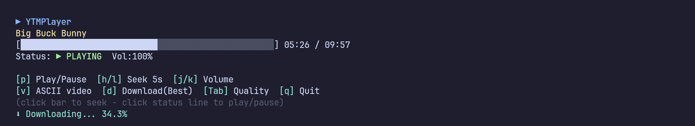

<div align="center">


# YTM-Player

**Paste a YouTube URL. Get the audio in your terminal — and the picture too, if you ask for it.**

A terminal YouTube player written in Rust. One binary, no runtime of its own:
it drives [mpv](https://mpv.io) and [yt-dlp](https://github.com/yt-dlp/yt-dlp)
over their native interfaces, streams audio into a small text UI, renders the
video as true-colour ASCII in the same terminal on a keypress, and pulls the
track down to disk in the background.

<p>
  <a href="https://github.com/Osyna/YTM-Player/actions/workflows/ci.yml"></a>
  <a href="https://github.com/Osyna/YTM-Player/releases/latest"></a>
  
  
  
  
  <a href="LICENSE"></a>
</p>


</div>

---

This started as a Bash script, and for a while that was fine — `mpv` did the
playing, `socat` poked its IPC socket, `jq` read the answers back and `bc` did
the arithmetic for the progress bar. Then one day it wouldn't start at all,
because `bc` wasn't installed. Four tools glued together with a format string,
and the whole thing fell over on the one nobody thinks about.

So it's Rust now: one binary, JSON parsed natively, the socket a plain
`UnixStream`, the arithmetic `f64`. mpv and yt-dlp.


## What it does

- **Audio playback** with a live progress bar, track title, clock and volume.
- **Audio-only by default.** Nothing decodes a picture until you ask for one, so
  an idle session never touches a video frame.
- **`v` puts the video in your terminal** — true-colour half-blocks through
  mpv's built-in `tct` renderer, at 144p by default. Playback doesn't stop,
  restart or re-buffer; the picture is a second track handed to the mpv that is
  already running. Press `v` again and the terminal comes back, with the audio
  never having noticed.
- **`d` saves the current track** into `downloads/` in the background, with a
  live percentage. At the default MP3 tier it's instant and needs no network at
  all — the audio was already captured while it streamed past.
- **`Tab` cycles quality**: `MP3 → 480p → 720p → 1080p → Best`. It sets what `d`
  writes, and anything above MP3 also raises the resolution the next `v` asks
  for.
- **Playlists** (`list=` URLs) are expanded and navigable with `n` / `b`, with
  the position shown as `4/100`.
- **The mouse works.** Click the progress bar to seek there; click the status
  line to toggle play/pause.


## Getting started

Grab a package for your distribution from the
[latest release](https://github.com/Osyna/YTM-Player/releases/latest). Each one pulls in
**mpv** and **yt-dlp** for you, and suggests **ffmpeg** — optional, and only used to merge
separate video and audio streams when downloading above MP3.

```sh
# Arch, Manjaro, EndeavourOS
sudo pacman -U ytmplayer-bin-3.0.0-1-x86_64.pkg.tar.zst

# Debian, Ubuntu, Mint, Pop!_OS
sudo apt install ./ytmplayer_3.0.0-1_amd64.deb

# Fedora, RHEL, openSUSE
sudo dnf install ./ytmplayer-3.0.0-1.x86_64.rpm
```

On Arch, `makepkg -si` against the attached `PKGBUILD` works too, and builds for aarch64.

Any other distribution — the tarball is one static binary that needs no libraries. Install
`mpv` and `yt-dlp` yourself:

```sh
curl -LO https://github.com/Osyna/YTM-Player/releases/latest/download/ytmplayer-3.0.0-x86_64-linux.tar.gz
tar xzf ytmplayer-3.0.0-x86_64-linux.tar.gz
sudo install -m755 ytmplayer-3.0.0-x86_64-linux/ytmplayer /usr/local/bin/
```

`aarch64` builds of every format are attached too. Checksums in `SHA256SUMS`.

Or build it — no C toolchain, no system libraries, four dependencies:

```sh
git clone https://github.com/Osyna/YTM-Player
cd YTM-Player
cargo build --release
sudo install -m755 target/release/ytmplayer /usr/local/bin/
```

## Using it

```sh
ytmplayer https://www.youtube.com/watch?v=dQw4w9WgXcQ
```

Playlist URLs need quoting, or the shell will background the job on the `&`:

```sh
ytmplayer "https://www.youtube.com/watch?v=XnG3YWYMY-I&list=RDQMxUfpwjvstDY&start_radio=1"
```

| Key | Action |
|---|---|
| `p` | Play / pause |
| `h` / `l` | Seek back / forward 5s |
| `j` / `k` | Volume down / up |
| `n` / `b` | Next / previous track (playlists) |
| `v` | Toggle ASCII video |
| `d` | Download the current track (press again to cancel) |
| `Tab` | Cycle quality: `MP3 → 480p → 720p → 1080p → Best` |
| `q` or `Ctrl+C` | Quit |

Click the progress bar to seek to that point; click the status line to toggle
play/pause.



## How it works

### Audio first, a picture only when asked

One yt-dlp call resolves a track and returns **both** URLs — full-quality audio
and a low-resolution video. mpv is handed only the audio and started with
`--no-ytdl`, so it never re-extracts anything and never demuxes a picture. The
video URL is kept in our pocket.

Press `v` and that URL is handed to the running mpv as an extra track. That is
why the toggle is instant and playback doesn't so much as hiccup: no new
process, no re-resolve, no seek back to where you were.

It also means resolution is decoupled from playback. `Tab` up to 720p and the
next `v` resolves and swaps the video track underneath you, while the same audio
keeps playing.

### Downloads

mpv writes the audio it is already streaming to a temp file as it goes. At the
MP3 default, `d` therefore has the whole track on disk the moment you press it —
ffmpeg transcodes the local file and there is no second trip to YouTube. Raise
the tier above MP3 and `d` becomes a real download, because the live stream is
audio and what you asked for isn't.

### Sharing a terminal with mpv

mpv's `tct` renderer paints the terminal directly, which makes it fast and makes
it a problem: for a while both mpv and the status bar were writing to the same
tty. A tty makes a single `write` atomic against other writers, so that looked
safe — but a pty that mpv is flooding at megabytes a second is usually close to
full, and then the kernel takes only part of a larger write. The rest goes out
in a second syscall, with mpv free to paint in the gap.

The result was half a status bar stranded in the middle of the picture, and
once, a cursor move chopped after `ESC [ 29;1` that printed its lone trailing
`H` on screen as a literal character.

So mpv doesn't hold the terminal any more. Its output comes to us on a pipe and
is forwarded by the one writer that owns the screen, cut only at points where no
escape sequence and no UTF-8 character is half-written. Both painters now go
through the same lock, and a short write can't hurt anyone because nothing else
is painting while it finishes.

### Footprint

| | RSS |
|---|---|
| `ytmplayer` itself | **2.8 MB** |
| mpv, audio-only (the default) | 88.5 MB |
| mpv, while you're watching | 106 MB |


### Changes from the Bash version

- `jq`, `socat` and `bc` are gone
- `v`, `d`, `Tab`, volume and mouse support

The full list is in [CHANGELOG.md](CHANGELOG.md).

## Uninstall

```sh
sudo pacman -Rns ytmplayer-bin   # Arch
sudo apt remove ytmplayer        # Debian / Ubuntu
sudo dnf remove ytmplayer        # Fedora / RHEL
sudo rm /usr/local/bin/ytmplayer # tarball or built from source
```

## Contributing

Pull requests are welcome. 
`cargo clippy --release --all-targets`
`cargo test --release`

## Thanks

- **[mpv](https://mpv.io)** — decodes and plays the stream, and draws the ASCII
  video via its own `tct` output. This project is mostly a nice way to talk to
  it.
- **[yt-dlp](https://github.com/yt-dlp/yt-dlp)** — resolves URLs and playlists
  to something playable, and keeps doing so as YouTube keeps changing its mind.
- [@ConttiDev](https://github.com/ConttiDev), who fixed the flicker in the Bash
  version back when there was a Bash version.


## License

[PolyForm Noncommercial 1.0.0](LICENSE). Use it, change it, share it, build on
it — for anything that isn't commercial. Personal use, hobby projects, private
entertainment, study and research are named in the licence, as are schools,
charities, public research bodies and government institutions. Selling it, or
using it to run a business, is not covered.

That makes it source-available rather than open source: the OSI definition
doesn't allow a field-of-use restriction, so there's no OSI badge here. If you
want to use it commercially, ask me.

mpv and yt-dlp are separate programs YTM-Player talks to over an IPC socket and
the command line. It doesn't link against either, so their licences govern them
and this one governs the code in this repository.
